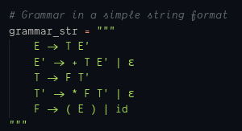
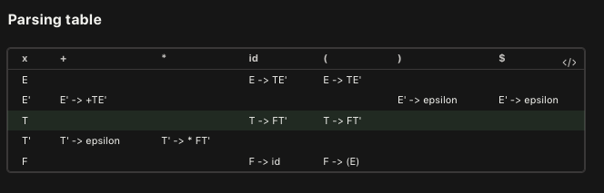
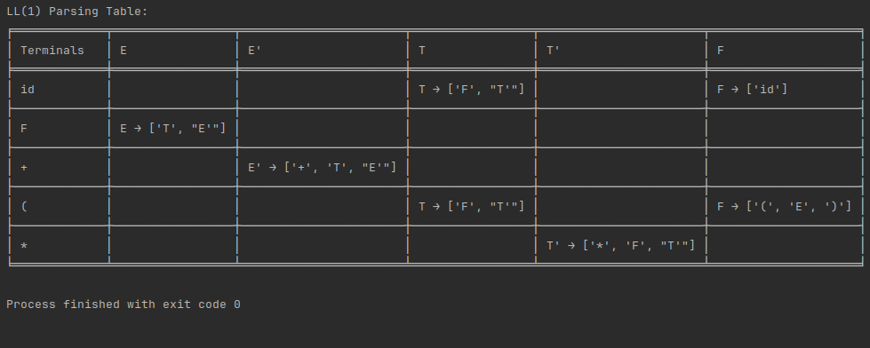

# LL(1) Parsing Table Generator

This Python script (attempts to) generate a LL(1) parsing table for a given grammar. Tbh this was a hack to come up with and I may need you guys' help making sure it works as intended.

## How to Use

1. Define Your Grammar: Modify the grammar_str variable within the script to represent your specific context-free grammar.
   Ensure that the grammar follows the format shown in the provided example.
   

2. You can also `pip install tabulate` to make sure hakuna dependancy issues.

3. Run and pray it works 😂

- You can specify your CFG within the grammar_str variable using the format in the image above (UKIWEKA YAKO HAITAWORK😂😂).

### How it works

1. It parses the provided grammar and organizes it into a data structure for processing.

2. Computes the FIRST sets for each non-terminal symbol in the grammar.

3. Generates the LL(1) parsing table, taking into account the FIRST sets and FOLLOW sets.

4. The generated parsing table is printed in a tabular format to the console using tabulate ofc.

## Example:
- This is an example of the grammar we used in class:
```
   E -> TE' 
   E' -> +TE' | epsilon
   T -> FT'
   T'  -> * FT' | epsilon
   F -> (E) | id
```
- We derived the following LL1 Table:


- The Algorithim derives a simmilar table. (We noticed the labels were inverted but we will maybe fix that later)

